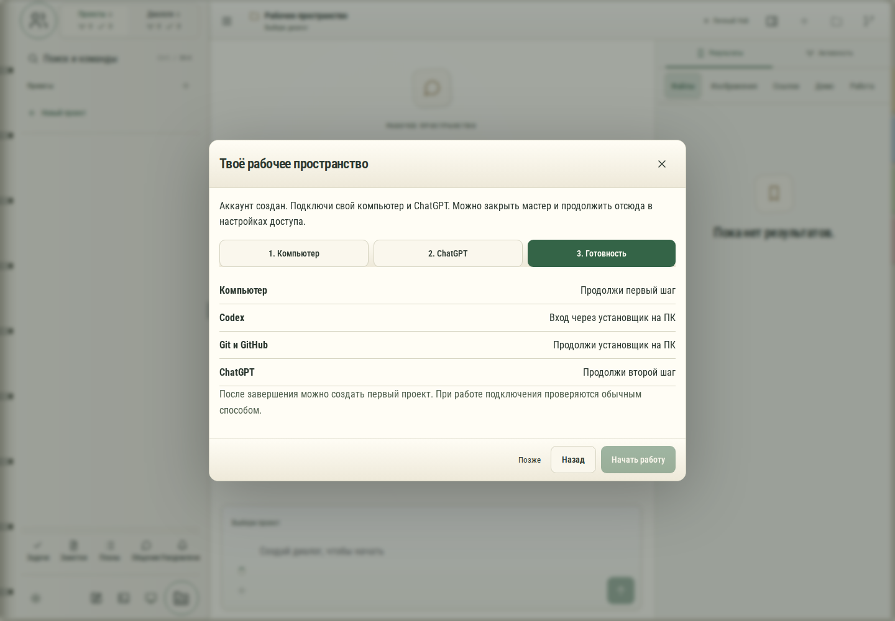

# 724. Настройка рабочего пространства

**Широкий экран · 1440 × 1000 · тема `organizer`.**

Первичная настройка рабочего пространства нового участника.

**Как открыть:** Первый вход нового участника или повторное открытие настройки.

**Снято после:** 3. Готовность. Рабочее состояние.

**Действия:** «Продолжить настройку позже»; «1. Компьютер»; «2. ChatGPT»; «3. Готовность»; «Позже»; «Назад»; «Начать работу».

**Для обсуждения:** Понятны ли следующий шаг и уже выполненные проверки? Какие объяснения нужны без знания устройства системы?

Снимок фиксирует вид интерфейса. Данные демонстрационные; ошибки, ожидания и конфликты могли быть созданы сценарием. Это не подтверждение состояния рабочего сервера или реальных интеграций.

**Источник:** [MemberSetup.tsx](../../apps/web/src/MemberSetup.tsx). Сценарий `member-setup`; код `56214b0`, 2026-10-02. Chromium; размер окна эмулируется, это не физический iPhone.

[Другой размер](724-phone.md) · [Раздел](README.md) · [Весь каталог](../README.md)
