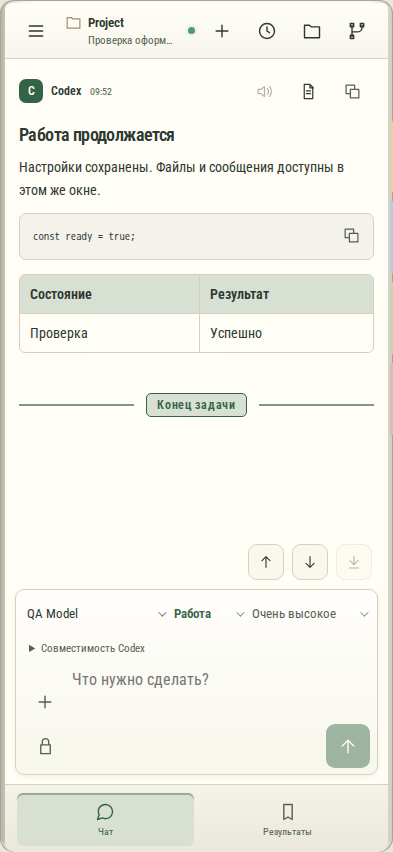

# 727. AppearanceSettings

**Телефон · 393 × 852 · тема `organizer`.**

Один интерфейс в различных темах и светлом/тёмном режиме.

**Как открыть:** Настройки → Оформление.

**Снято после:** Открытие рабочего экрана. Рабочее состояние.

**Действия:** «Добавить файлы или изображения»; «Отправить сообщение».

**Поля и параметры:** «Модель Codex»; «Режим Codex»; «Уровень размышления»; «Доступ Codex»; «Сообщение Codex».

**Для обсуждения:** Сохраняются ли иерархия, читаемость и смысл действий при смене материалов и цвета?

Снимок фиксирует вид интерфейса. Данные демонстрационные; ошибки, ожидания и конфликты могли быть созданы сценарием. Это не подтверждение состояния рабочего сервера или реальных интеграций.

**Источник:** [AppearanceSettings.tsx](../../apps/web/src/AppearanceSettings.tsx). Сценарий `theme-variants`; код `56214b0`, 2026-10-02. Chromium; размер окна эмулируется, это не физический iPhone.

[Другой размер](727-desktop.md) · [Раздел](README.md) · [Весь каталог](../README.md)
