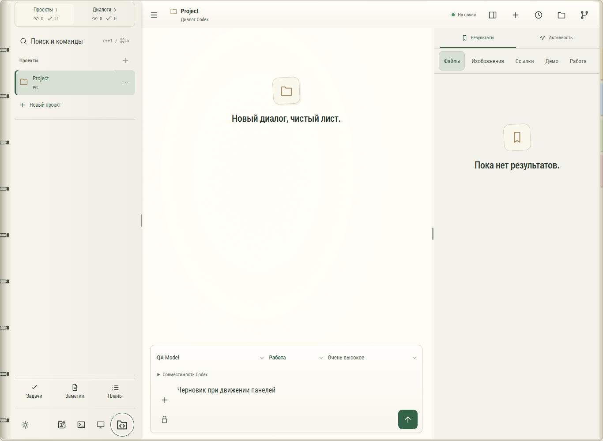

# Органайзер: Codex, 1366×1000

Снимок реального веб-интерфейса из локальной browser-fixture с тестовым
проектом и пустыми результатами, не пользовательская история.

Левая и правая области продолжают общий корпус. Короткие ручки меняют
ширину; сплошной линии вдоль разделителя нет. У зелёной и 2000 удалены
вложенный корпус навигации и лишняя внешняя рамка результатов.
