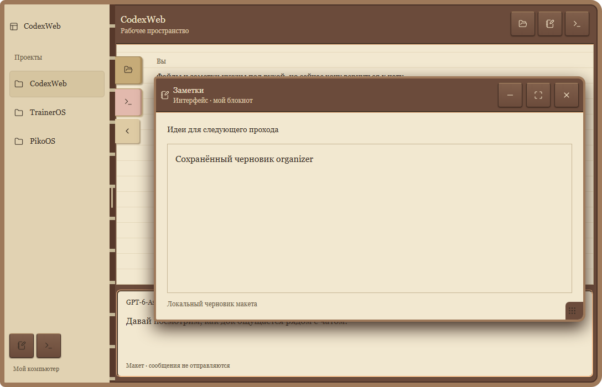

# Заметка восстановлена

Органайзер: закладки, выходящие из переплёта.

Окно заметок возвращено из дока. На корпусе доступны сворачивание, разворачивание и закрытие. Черновик пережил цикл сворачивания. В доке остались файлы и терминал.

Снимок интерактивного предложения, Chromium, 1120 px. Содержимое демонстрационное. Функция не установлена; физическое устройство не проверялось.
